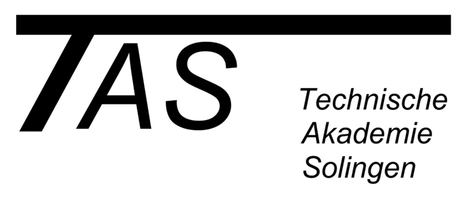

# TAS-Projekt Datenbanken HITO
## Mitglieder:
* Sam Seidel
* Jonas Burghaus
* Linus Alexander Poop
* Luis Bregas
* Robin Nachtigall
* Collin David Klein
  
## Zu machen
- [X] ER-Modell
- [X] Rel. Datenbank Modell
- [ ] Anforderungsliste
- [X] Datenbank  
- [ ] Dokumentation (Robin)
      
Die Scripte (PHP / javascript)
  > - Eine Grafische oberfläche für alles machne. Für alle tabellen gibt es einzelne "tabs" z.b. Schüler. Auf diesen "tabs" kann man entweder einen neuen Schüler erstellen oder von einem Ausgewähltem schüler sich seine Rechnung als .PDF speichern kann usw.  
  > - Einheitliches CSS overlay geschalten wenn die Scripte fertig sind.  
  > - Zum Erstellen von .PDF dateien 'Ghostscript' verwenden
  > - Wenn man z.b. auf dem "Tab" schüler ist kann man z.b. alle schüler einer klasse mit einem Dropdownmenü auswählen     von welchen man dann die Rechnung oder so herunterladen kann.  
 
  - 1. [ ] Grafische Oberfläche (Linus, ist irgendwie idfk)
  - 2. [X] Student (Eitnragen, zuweisen von Kursen und Rechnungen, speichern) (Eintragen macht Sam, Verwaltung ist Fertig)
  - 3. [ ] Rechnung (Erstellen und Speichern. Bestimmte abrufen und als .PDF speichern) (Luis)
  - 4. [ ] Honorarvertrag (Erstellen, Speichern) (Jonas Erstellen ist fertig)
  - 5. [ ] Dozent (Eintragen, zuweisen von Kursen und Rechnung speichern) (Jonas und Luis)
  - 6. [ ] Anmeldeformular (Teilnehmer, Dozent, Kurs, Rechnung zuweisung) (Sam mit Sprung zum eintragen von Betrieben)
  - 7. [ ] Gesamte UI machen für die Administration und die einzelnen anmeldungen für normale Menschen machen (Linus)
 

> [!NOTE]
> Alles im Klassentauschverzeichniss unter 'BEASTMODE' gespeichert, sowie auf GitHub 
